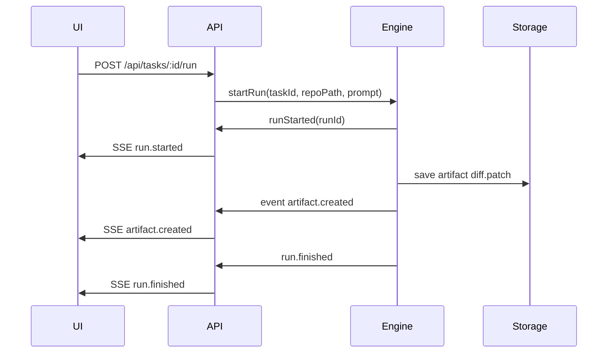

# Architettura — coding-dashboard

Obiettivo
- Documentare componenti, flussi di eventi (SSE) e interfacce tra backend, engine e frontend.

Componenti principali
- Frontend (`apps/web`): UI SPA, consumo SSE, actions REST.
- Backend (`server` / `apps/server`): API REST, SSE endpoint, repository layer (SQLite).
- Engine: `AgentEngine` adapters (mock, copilot-cli, copilot-sdk).
- Storage: `storage/db.sqlite`, `artifacts/`.
- Integrations: VS Code local open, optional Docker runners.

Diagrammi (bozza)

Component diagram (Mermaid)
```mermaid
graph TD
  UI[Web UI]
  API[Backend API (Express)]
  Engine[AgentEngine]
  DB[SQLite Storage]
  ART[Artifacts FS]

  UI -->|REST/SSE| API
  API -->|calls| Engine
  Engine --> DB
  Engine --> ART
  API --> DB
```

Sequence: Run lifecycle


Event model (flatten)
- `run.started`, `assistant.message`, `tool.call`, `tool.result`, `artifact.created`, `validation.done`, `run.needs_review`, `run.finished`.

Sicurezza e restrizioni
- Allowlist root repos in `config/repos.allowlist.json`.
- Validation cmd limitati al `task.validationPlan`.
- Engine esegue comandi solo nella branch dedicata e con UID di processo limitato.

Interfacce API (riassunto)
- `POST /api/tasks/:id/run` -> crea run, risponde runId.
- `GET /api/runs/:id/stream` -> SSE stream eventi.
- `GET /api/runs/:id/artifacts` -> lista artifact.
- `POST /api/runs/:id/validate` -> lancia validation plan.

Strumenti consigliati per i diagrammi
- Mermaid (in repo Markdown) per diagrammi veloci.
- Figma / Draw.io per diagrammi estesi e deliverable di design.

Prossimi passi
- Refinire sequence e component diagram con dettagli di rete/autenticazione.
- Creare ER schema SQLite (tasks, runs, artifacts, validations) e aggiungerlo qui.
