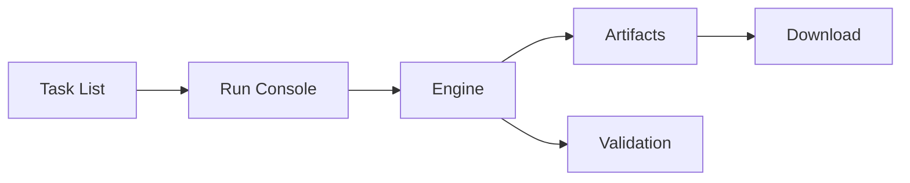

# UX / UI Design — coding-dashboard

Scopo
- Progettare un'interfaccia moderna, accessibile e scalabile per la dashboard agent-run.

Principi di design
- Layout a 3 colonne (responsive) con topbar persistente.
- Accessibilità: contrasto, keyboard navigation, ARIA.
- Component-driven: design system riutilizzabile (tokens + component library).

Design System (bozza)
- Palette colori: primario, secondario, surface, success, warning, danger.
- Tipografia: Inter (variante system fallback), scale 14/16/20/24.
- Spacing: base 8px scale.
- Componenti chiave: `TopBar`, `TaskList`, `RunConsole`, `Composer`, `ArtifactsPanel`, `ValidationPanel`.

Wireframe principale
- TopBar: project selector, engine/model selector, New Task, Settings, stato run.
- Colonna sinistra (25%): search + filters + lista task.
- Colonna centrale (50%): run console con tabs (Conversation / Tool log / Diff summary) + composer.
- Colonna destra (25%): Artifacts / Validation / Files changed.

Interazioni critiche
- SSE stream aggiornamenti in tempo reale per console e status.
- Azioni rapide: Run, Open in VS Code, Download patch, Apply patch (local).
- Modal New Task con selezione repo e context files.

Tooling consigliato
- Figma per prototipi UI ad alta fedeltà.
- Storybook per componenti React (implementazione).
- Tailwind CSS + Radix UI / Headless UI per componenti accessibili.

Esempio semplice di diagramma (Mermaid)

Deliverable iniziali
- Wireframes a bassa fedeltà (PNG/SVG)
- Mockups ad alta fedeltà (Figma)
- Design tokens (JSON)
- Storybook skeleton

Prossimi passi
- Confermiamo palette e tipografia.
- Creo wireframes ad alta fedeltà in Figma o static PNG.
